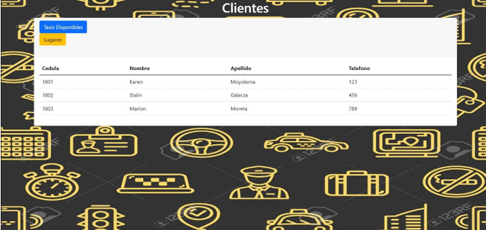
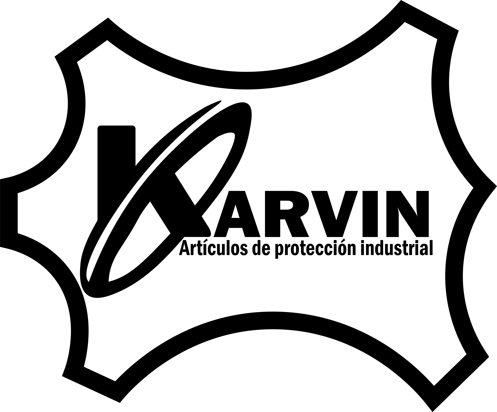
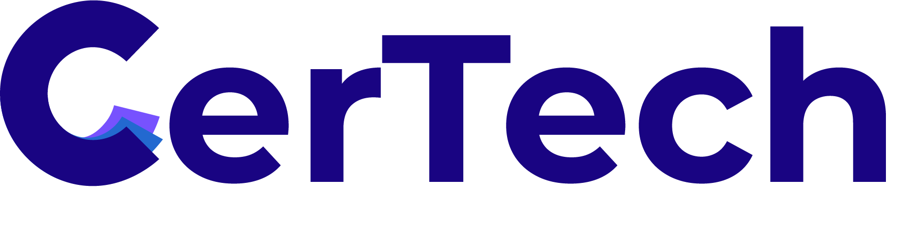

<h1 align="center"><b>Hi , I'm Karen Moyolema</b></h1>
<!--  -->

  

 

	
## <picture></picture> #About me

** 👋 Let me introduce myself**

I'm a software engineer passionate about creating impactful digital experiences.

- 💻 **Frontend Development:** My specialty lies in creating intuitive and dynamic user interfaces.
- 🖥️ **Backend Development:** I have solid experience in building robust and scalable server-side applications.
- 🎨 **Interface Design:** I have ventured into design, creating visually appealing and user-friendly interfaces.
- 🌐 **Broad Knowledge Base:** My expertise extends to networks, databases, and the creation of mobile and web applications.

In my free time:
- 🚀 **Exploring Emerging Fields:** I take on personal projects that challenge my skills and knowledge.
- ⚽ **Playing Soccer:** This keeps me active and alert.

🔍 I consider every day an opportunity to learn something new and explore technological advances. I am excited to continue growing on this exciting technological journey and provide creative solutions to future challenges!

## <b> Skills</b>
 

### **Languages**:

### **Front-End Development**:

### **Frameworks**:

### **Databases**:

### **Softwares and Tools**:

 

 
 

-----

 

## <b> Github Stats </b>
 

username&show_icons=true&theme=radical)

</a>

 
 
 

-----

 
## 🛠️ Projects
 

### [Taxi Manager](https://example.com/taxi-manager)
Design of a distributed architecture for a taxi ride management application, with components distributed across multiple servers to improve performance and scalability.
 

### [Karvin Curtiduria](https://dev-karvin-curtiduria.pantheonsite.io/)
Karvin Curtiduria offers high quality tanned leather, efficiently managing production, inventory and orders through our web platform.
 

### [Web application for Certificate Management (FrontEnd)](https://github.com/karenlizbeth03/Web-application-for-Certificate-Management-FrontEnd-)
Development of a FrontEnd Web Application for Certificate Management - This project consists of the creation of a web application for the generation and administration of certificates.
 

 
## src="https://github.com/0xAbdulKhalid/0xAbdulKhalid/raw/main/assets/mdImages/handshake.gif" width ="80"><b> Let's Connect..!</b>

<ul>

<li>

</li>

 

<li>

</li>

 

<li>

</li>
	
</ul>

 

 
 
 

## <b>FOLLOW YOUR DREAM✨</b>

 
 
 
 

---

 

